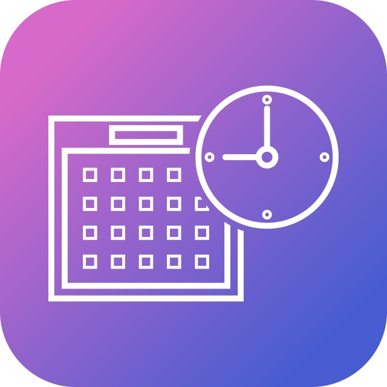

<!-- PROJECT LOGO -->
 

  

  <h3 align="center">OnlyEvent</h3>

  

    La aplicacion que estabas buscando para tus eventos
     
    <a href="https://github.com/MartinezMarcelo/onlyEvent/tree/main/"><strong>Explore the docs »</strong></a>
     
     
    <a href="https://marvelapp.com/prototype/gig3234">Prototype desing</a>
    ·
    <a href="https://github.com/MartinezMarcelo/onlyEvent/issues">Report Bug</a>
    ·
    <a href="https://github.com/MartinezMarcelo/onlyEvent/issues">Request Feature</a>
  

<!-- TABLE OF CONTENTS -->

  
Table of Contents

  <ol>
    <li>
      <a href="#about-the-project">About The Project</a>
      <ul>
        <li><a href="#built-with">Built With</a></li>
      </ul>
    </li>
    <li>
      <a href="#getting-started">Getting Started</a>
    </li>
  </ol>

<!-- ABOUT THE PROJECT -->
## About The Project

[![Product Name Screen Shot][product-screenshot]]

Es una aplicacion que tiene como funcionalidad ayudar a   la personas  para que encuentren   eventos publicos o privados si fue invitado. Tambien podran visualizar sus eventos agendados  y asistir , realizar preguntas  etc.

Caracteristicas:
* Ver eventos  publicos 
* Asistir a  eventos  publicos o privado si fue invitado
* Buscar eventos
* Ver eventos agendados
* Crear comentarios
 

Caracteristicas Futuras :
* chat con las personas que asistiran

<!-- MARKDOWN LINKS & IMAGES -->
<!-- https://www.markdownguide.org/basic-syntax/#reference-style-links -->
[product-screenshot]: images/screenshot.jpg
