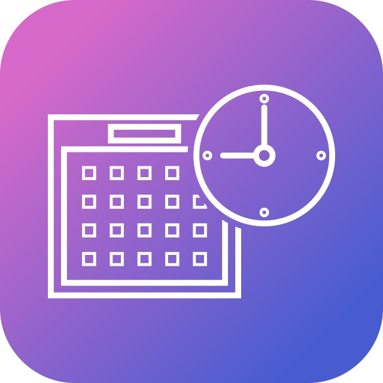

<!--
*** Thanks for checking out the Best-README-Template. If you have a suggestion
*** that would make this better, please fork the repo and create a pull request
*** or simply open an issue with the tag "enhancement".
*** Thanks again! Now go create something AMAZING! :D
-->


<!-- PROJECT LOGO -->
<br />
<p align="center">
  <a href="https://github.com/othneildrew/Best-README-Template">
    
  </a>

  <h3 align="center">OnlyEvent</h3>

  <p align="center">
    La aplicacion que estabas buscando para tus eventos
  </p>
</p>


<!-- TABLE OF CONTENTS -->
<details open="open">
  <summary>Table of Contents</summary>
  <ol>
    <li>
      <a href="#built-with">Built With</a></li>
    </li>
    <li>
      <a href="#getting-started">Getting Started</a>
      <ul>
        <li><a href="#prerequisites">Prerequisites</a></li>
        <li><a href="#installation">Installation</a></li>
      </ul>
    </li>
    <li><a href="#usage">Usage</a></li>
    <li><a href="#contact">Contact</a></li>
    <li><a href="#acknowledgements">Acknowledgements</a></li>
  </ol>
</details>


### Built With

En esta parte se agrega los modulos o librerias  que utilizara la aplicación.

  Ui
  * [NativeBase](https://nativebase.io/)
  
  NetWork
  * [Redux](https://es.redux.js.org/)


<!-- GETTING STARTED -->
## Getting Started
  * [Install Node with NVM](https://github.com/creationix/nvm).
  * [Install YARN](https://yarnpkg.com/)
  * [Install React Native](https://facebook.github.io/react-native/).
  * [Install React Native Debugger](https://github.com/jhen0409/react-native)

### Prerequisites :
*create the local.properties file on `android/`*
*Inside the file put this depending of your OS*

Windows:
sdk.dir = ```
C:\\Users\\TU_USUARIO\\AppData\\Local\\Android\\Sdk```

Linux:
sdk.dir = ```
/home/TU_USUARIO/Android/Sdk```

### Installation
* Run ```yarn install``` to install dependencies in the project directory.
* Run the React Native Packager: 
```
react-native start
```
* Ensure you have started your Android simulator.
* Run both platforms with 
  ```
  npm start
   ```
* Or run them individually:
  * Run Android with 
  ```
  yarn run android
  ```
  

<!-- USAGE EXAMPLES -->
## Usage

Use this space to show useful examples of how a project can be used. Additional screenshots, code examples and demos work well in this space. You may also link to more resources.

_For more examples, please refer to the [Documentation](https://example.com)_


<!-- LICENSE -->
## License

Distributed under the MIT License. See `LICENSE` for more information.


<!-- CONTACT -->
## Contact

Your Name - [@your_twitter](https://twitter.com/your_username) - email@example.com

Project Link: [https://github.com/your_username/repo_name](https://github.com/your_username/repo_name)


<!-- ACKNOWLEDGEMENTS -->
## Acknowledgements
* [GitHub Emoji Cheat Sheet](https://www.webpagefx.com/tools/emoji-cheat-sheet)
* [Img Shields](https://shields.io)
* [Choose an Open Source License](https://choosealicense.com)
* [GitHub Pages](https://pages.github.com)
* [Animate.css](https://daneden.github.io/animate.css)
* [Loaders.css](https://connoratherton.com/loaders)
* [Slick Carousel](https://kenwheeler.github.io/slick)
* [Smooth Scroll](https://github.com/cferdinandi/smooth-scroll)
* [Sticky Kit](http://leafo.net/sticky-kit)
* [JVectorMap](http://jvectormap.com)
* [Font Awesome](https://fontawesome.com)


<!-- MARKDOWN LINKS & IMAGES -->
<!-- https://www.markdownguide.org/basic-syntax/#reference-style-links -->
[product-screenshot]: images/screenshot.jpg
